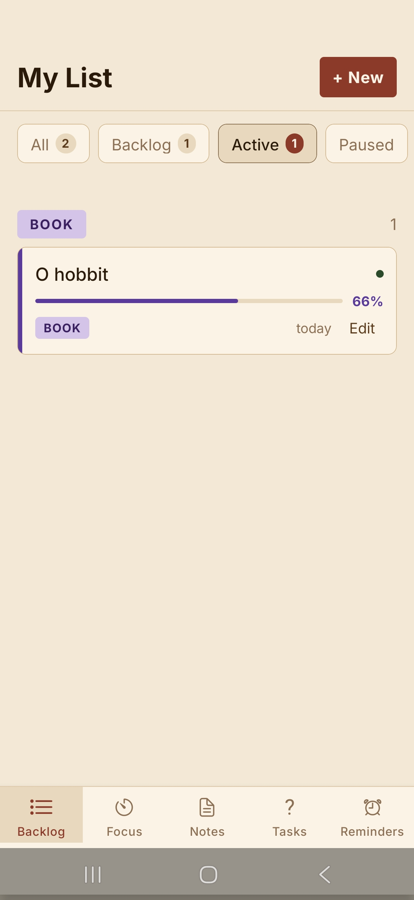
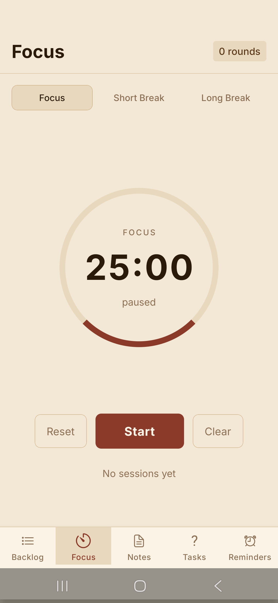
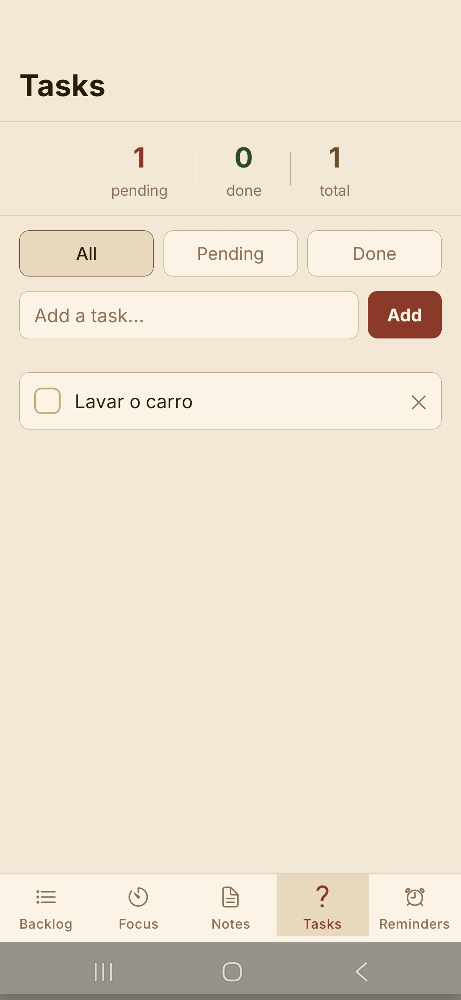
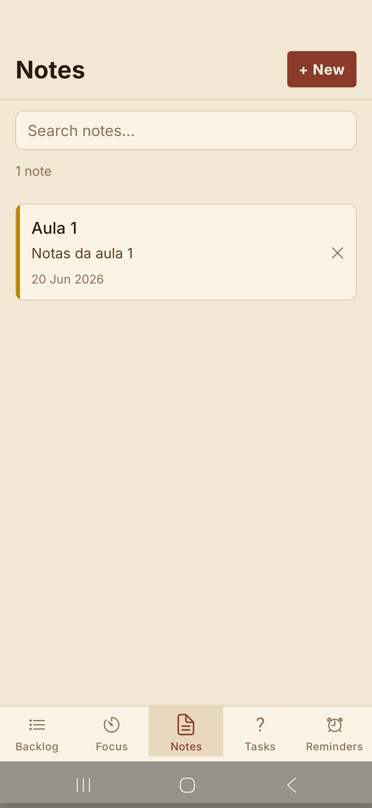
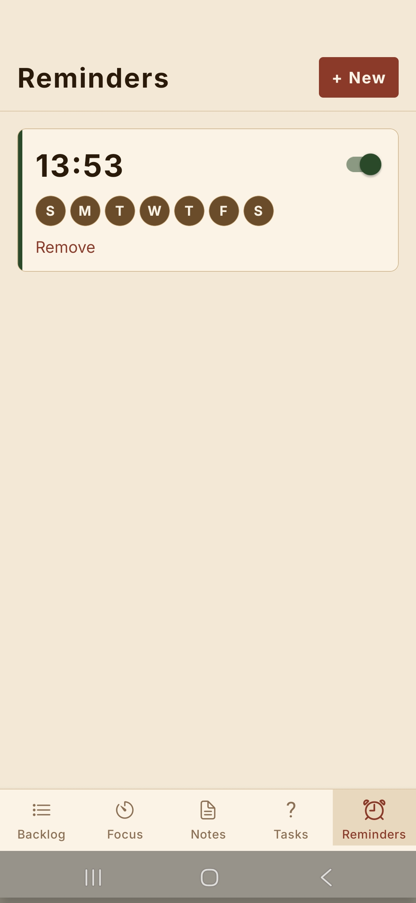

# Focus Tracker ⚔️

A personal productivity app built for people who start things and never finish them.

Track books, courses, movies, series and games — with native Android alarms that open full screen when it's time to make progress. Built entirely with React Native and a custom Kotlin module.

## The problem

You start reading a tech book. Chapter 3 is where you stop.
You enroll in a course. Module 2, same story.
You add something to your watch later list. It lives there forever.

Focus Tracker fixes this with a simple loop: **add → track → get reminded → log progress → repeat.**

## Features

- **Backlog** — queue everything you want to consume, organized by category with filters
- **Progress tracking** — measured in real units (pages, episodes, hours), not just percentages
- **History log** — every session recorded with date, description and current position
- **Native Android alarms** — full screen, with sound, opens directly on the item
- **Snooze** — 10 minute snooze built into the alarm screen
- **Abandonment detection** — notifies you when an item goes 5+ days without progress
- **Pomodoro timer** — dedicated focus screen with short and long breaks
- **To-do list** — quick tasks with filters, completion tracking and daily summary
- **Notes** — markdown-style notes with search and quick edit modal
- **Reminders** — custom alarms per item, linked directly to what you're tracking

## Stack

- React Native + Expo SDK 54 (TypeScript)
- AsyncStorage for local persistence
- Expo Notifications for abandonment alerts
- Custom Expo Module in Kotlin — native Android alarm with full screen intent, WakeLock and BroadcastReceiver
- Expo Background Fetch + Task Manager for background checks
- React Navigation (bottom tabs + native stack)
- Google Fonts — Inter

## Screenshots







## Running locally

```bash
git clone https://github.com/fabriciocc/focus-tracker
cd focus-tracker
npm install
npx expo start --dev-client
```

For a local Android build:

```bash
npx expo run:android
```

